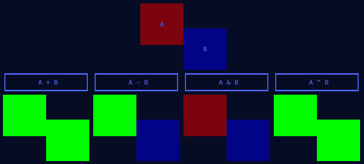

# rects

[](https://github.com/salt-die/rects/actions/workflows/run-tests.yaml)

A library for unions, intersections, subtractions, and xors of rectangles.

The result of set operations on two rects are shown by the green regions below:



Regions
-------
Let's say we have the following rects:
```
    +------------+   +--------+
    |            |   |    B   |
    |        +-----------+    |
    |    A   |     C     |    |
    |        +-----------+----+
    |            |
    +------------+
```

And we want to represent the region `A + B - C`:
```
    +------------+   +--------+
    |            |   |        |
    |        +---+   +---+    |
    |        |           |    |
    |        +---+       +----+
    |            |
    +------------+
```

One method is to divide the area into a series of mutually exclusive horizontal bands:
```
    +------------+   +--------+
    |            |   |        |
    +--------+---+   +---+----+
    | a      | b         | c  | d   <- 2nd band with walls at a, b, c, d.
    +--------+---+       +----+
    |            |
    +------------+
```

Each band is a vertical interval and a list of walls. Each contiguous pair of walls indicates a new rect in the band.
A `Region` is a list of sorted, mutually exclusive bands.

Using `rects`
------------
To use rects, construct an initial `Region`, `r`, from some rect and iteratively
`+`, `-`, `&`, or `^` with other regions:
```py
>>> from rects import *
>>> r = Region.from_rect(Rect(0, 0, 100, 200))
>>> s = Region.from_rect(Rect(10, 25, 40, 75))
>>> t = Region.from_rect(Rect(45, 75, 50, 125))
>>> r
Region(bands=[Band(y1=0, y2=100, walls=[0, 200])])
>>> v = r - s - t
>>> v
Region(bands=[
    Band(y1=0, y2=10, walls=[0, 200]),
    Band(y1=10, y2=45, walls=[0, 25, 100, 200]),
    Band(y1=45, y2=50, walls=[0, 25]),
    Band(y1=50, y2=95, walls=[0, 75]),
    Band(y1=95, y2=100, walls=[0, 200])
])
>>> list(v.rects())
[
    Rect(y=0, x=0, height=10, width=200),
    Rect(y=10, x=0, height=35, width=25),
    Rect(y=10, x=100, height=35, width=100),
    Rect(y=45, x=0, height=5, width=25),
    Rect(y=50, x=0, height=45, width=75),
    Rect(y=95, x=0, height=5, width=200)
]
>>> v.bbox
Rect(y=0, x=0, height=100, width=200)
```